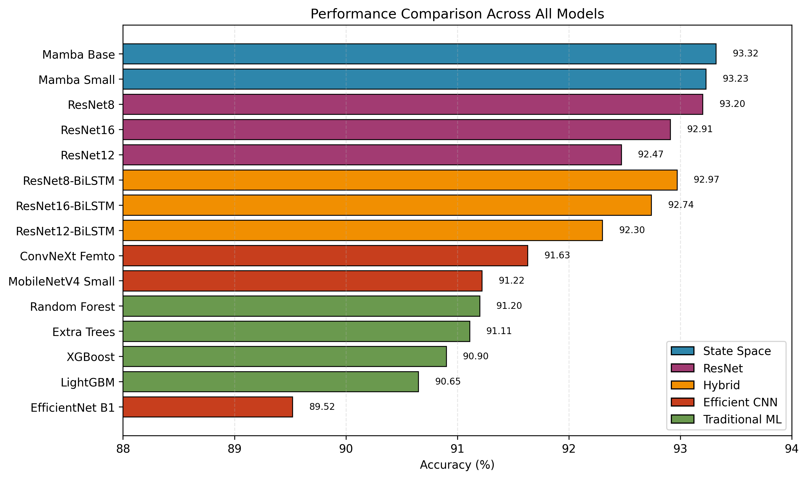
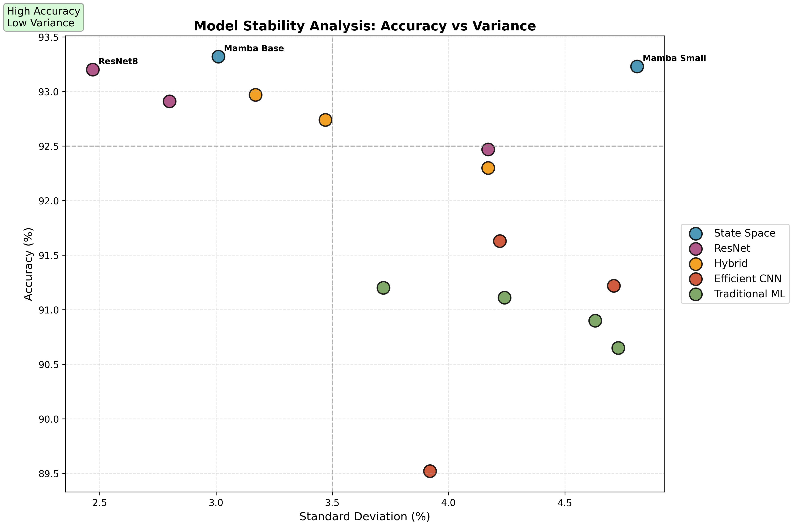
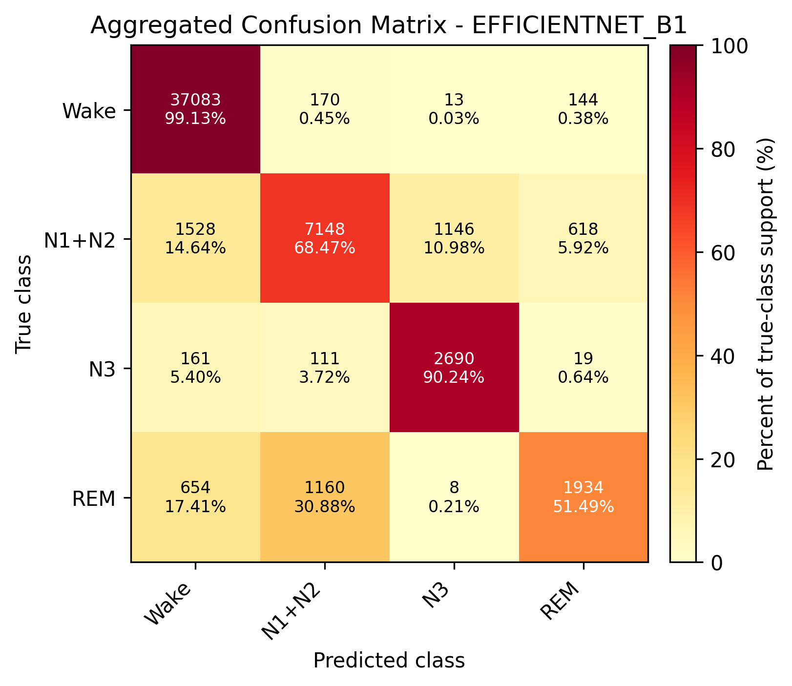
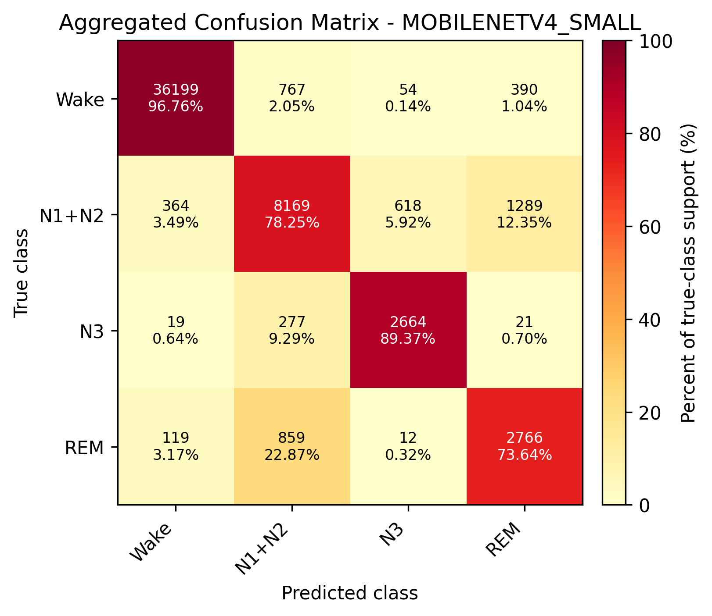
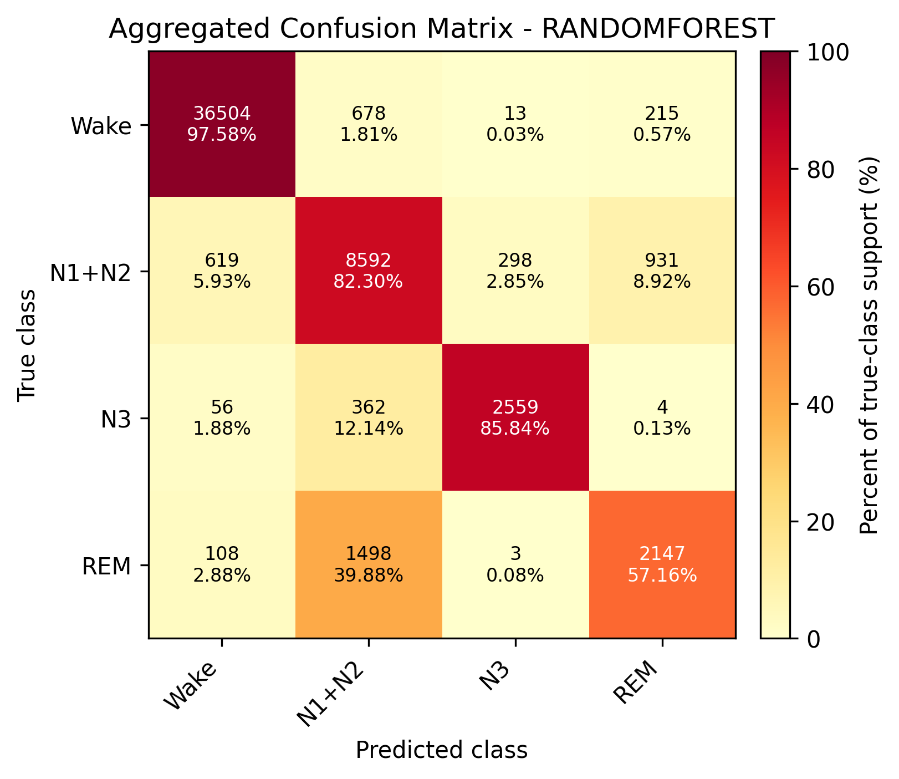
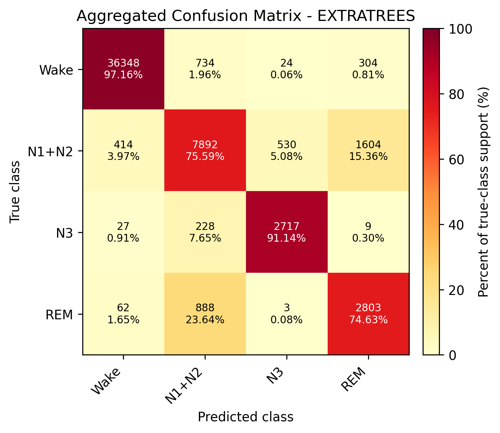
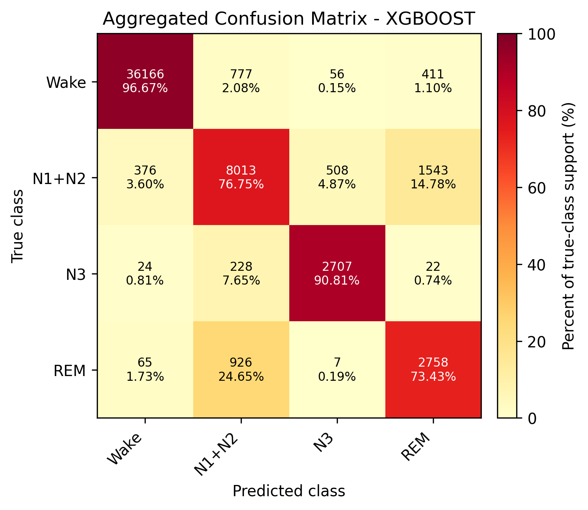
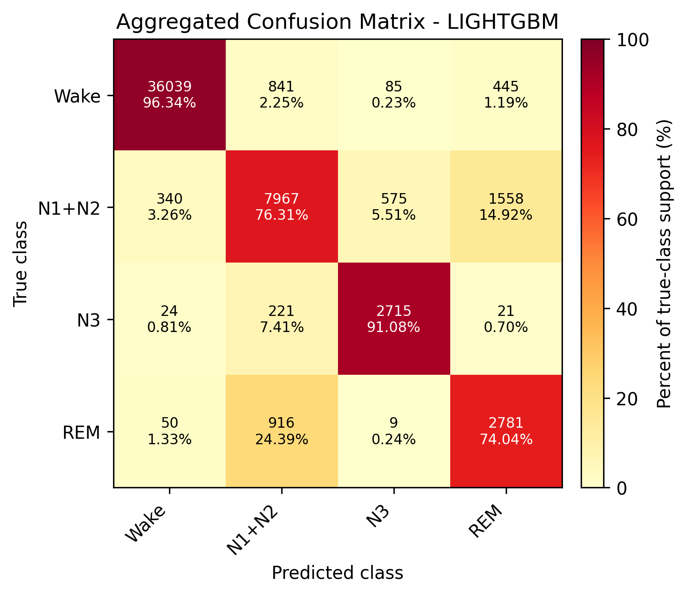

# Mamba Meets Sleep: Do State Space Models Outperform CNNs for EEG Classification?

Automatic sleep stage classification from EEG signals is critical for diagnosing sleep disorders, yet most studies evaluate architectures in isolation. We present a systematic evaluation of 15 models across five families: traditional machine learning, residual CNNs, hybrid ResNet-BiLSTM, efficient CNNs, and state space models. Using Sleep-EDF with leave-one-subject-out cross-validation on 20 subjects, we assessed subject-independent generalization. **Mamba Base achieved the highest accuracy (93.32% ± 3.01%)** and recall (87.11%), while **ResNet8 provided comparable accuracy (93.20%) with lowest variance (2.47%)**. Our comprehensive comparison reveals clear trade-offs between accuracy, stability, efficiency, and deployment constraints.

## Key Results

| Model | Accuracy (%) | Std Dev (%) | Parameters | Cohen's κ |
|-------|--------------|-------------|------------|-----------|
| **Mamba Base** | **93.32** | 3.01 | 703K | 0.864 |
| **Mamba Small** | **93.23** | 4.81 | 132K | 0.864 |
| **ResNet8** | **93.20** | **2.47** | 2.18M | 0.860 |
| ResNet8-BiLSTM | 92.97 | 3.17 | 2.83M | 0.855 |
| ResNet16 | 92.91 | 2.80 | 4.63M | 0.852 |

*Full results for all 15 models available in the paper.*


*Figure 1: Performance comparison across all 15 models*


*Figure 2: Accuracy vs variance trade-off analysis*

---

## Repository Structure
```
├── models/                    # Model implementations
│   ├── resnet.py             # ResNet variants (8/12/16 layers)
│   ├── resnet_bilstm.py      # Hybrid ResNet-BiLSTM architectures
│   ├── mamba.py              # Mamba Small & Base (State Space Models)
│   ├── traditional_ml.py     # Random Forest, XGBoost, LightGBM
│   └── efficient_nets.py     # EfficientNet B1, MobileNetV4, ConvNeXt
├── results/                   # Output directory for trained models
├── figures/
│   ├── confusion_matrices/    # Per-model confusion matrices
│   ├── fig1_accuracy_comparison.png
│   └── fig2_stability_analysis.png
└── README.md                  # This file
```

## Model Architectures

### State Space Models (Mamba)
- **Mamba Small:** 132K parameters
- **Mamba Base:** 703K parameters
- Linear complexity O(n) for sequence modeling
- Selective state space mechanism

### Residual CNNs
- **ResNet8:** 2.18M parameters (best stability)
- **ResNet12:** 3.41M parameters
- **ResNet16:** 4.63M parameters
- Skip connections + batch normalization

### Hybrid Models
- ResNet8/12/16 + BiLSTM layers
- Combines spatial and temporal feature extraction

### Efficient CNNs
- **EfficientNet B1:** 7.00M parameters
- **MobileNetV4 Small:** 296K parameters  
- **ConvNeXt Femto:** 4.54M parameters

### Traditional ML
- Random Forest, Extra Trees, XGBoost, LightGBM
- 47 engineered time/frequency domain features

---

## Evaluation Protocol

**Cross-Validation:** Leave-One-Subject-Out (LOSO)  
**Subjects:** 20  
**Metrics:** Accuracy, Precision, Recall, F1-Score, Cohen's Kappa  
**Significance:** Subject-independent generalization reflects real clinical deployment

---

## Key Findings

1. **Simpler architectures often outperform complex ones:** ResNet8 beats ResNet12/16
2. **Adding recurrence doesn't always help:** BiLSTM layers increased cost without gains
3. **State space models are competitive:** Mamba achieves highest accuracy with linear complexity
4. **Traditional ML remains viable:** 90-91% accuracy with minimal compute
5. **Trade-offs matter:** Choose based on deployment constraints (GPU, edge, CPU-only)

---

## Confusion Matrices

Detailed per-class performance analysis for all 15 models, organized by architecture family.

### State Space Models (Top Performers)

<table>
<tr>
<td width="50%">
  
**Mamba Base**
  


</td>
<td width="50%">
  
**Mamba Small**


</td>
</tr>
</table>

### Residual CNNs

<table>
<tr>
<td width="33%">
  
**ResNet8**


</td>
<td width="33%">

**ResNet12**


</td>
<td width="33%">

**ResNet16**


</td>
</tr>
</table>

### Hybrid ResNet-BiLSTM Models

<table>
<tr>
<td width="33%">

**ResNet8-BiLSTM**


</td>
<td width="33%">

**ResNet12-BiLSTM**


</td>
<td width="33%">

**ResNet16-BiLSTM**


</td>
</tr>
</table>

### Efficient CNNs

<table>
<tr>
<td width="33%">

**EfficientNet B1**



</td>
<td width="33%">

**MobileNetV4 Small**



</td>
<td width="33%">

**ConvNeXt Femto**


</td>
</tr>
</table>

### Traditional Machine Learning

<table>
<tr>
<td width="50%">

**Random Forest**



</td>
<td width="50%">

**Extra Trees**



</td>
</tr>
<tr>
<td width="50%">

**XGBoost**



</td>
<td width="50%">

**LightGBM**



</td>
</tr>
</table>

**Key Observations:**
- All models show strong diagonal patterns indicating good overall classification
- W (wake) and REM stages are generally well-separated across all architectures
- N1 (stage 1 sleep) remains the most challenging class, often confused with N2
- State space models (Mamba) and ResNet8 show the most balanced per-class performance
- Traditional ML models achieve competitive results despite simpler feature representations

---

## Citation

If you use this code or findings in your research, please cite:
```bibtex
@software{mehrabi2025mamba,
  title={Mamba Meets Sleep: Do State Space Models Outperform CNNs for EEG Classification?},
  author={Mostafa Mehrabi},
  year={2025},
  url={https://github.com/mostafamehrabii/sleep-stage-classification}
}
```

## 📧 Contact

Questions? Open an issue or contact mmehrabi.mostafa@gmail.com

---

⭐ **Star this repo if you find it useful!**
